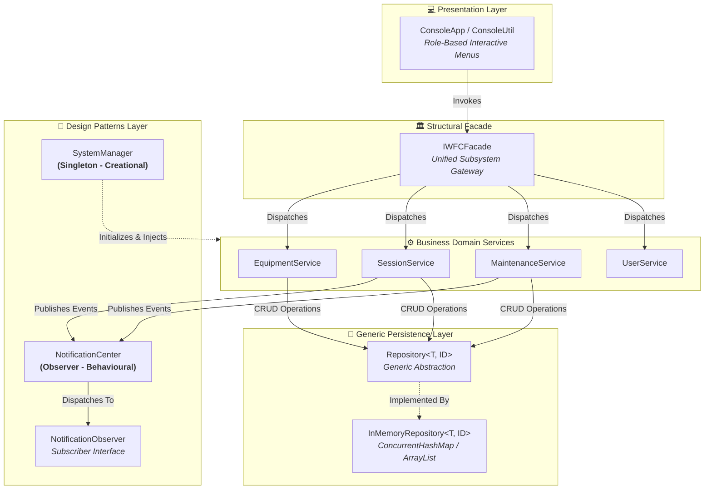

# 🏋️ Intelligent Wellness and Fitness Center (IWFC)
### *Next-Generation Object-Oriented Enterprise Management System*

[](https://www.oracle.com/java/)
[-brightgreen?style=for-the-badge&logo=apachemaven&logoColor=white)](https://maven.apache.org/)
[](https://junit.org/junit5/)
[](https://www.cardiffmet.ac.uk/)
[](#)

<p align="center">
  <b>A production-grade, extensible Java prototype demonstrating advanced OOP constructs, formal GoF Design Patterns, generic collection pipelines, and custom exception handling.</b>
</p>

[✨ Key Features](#-key-features) •
[🏛️ Architecture](#-system-architecture) •
[🧩 Design Patterns](#-design-patterns-implemented) •
[🚀 Quick Start](#-quick-start--installation) •
[🧪 Test Suite](#-automated-testing--verification) •
[👥 Demo Accounts](#-demo-accounts)

---

</div>

## 📌 Executive Summary

The **Intelligent Wellness and Fitness Center (IWFC)** is an enterprise management platform designed to eliminate manual scheduling bottlenecks, minimize equipment maintenance downtime, and guarantee conflict-free fitness operations.

Engineered for **CMP 7001 (Advanced Programming)**, this software prototype complies strictly with Cardiff Metropolitan University's postgraduate standards, achieving an optimal balance between domain entity modeling, defensive exception boundaries, and decoupling via classical **Gang of Four (GoF)** design patterns.

---

## ✨ Key Features

| Capability | Module | Description |
| :--- | :---: | :--- |
| **🛠️ Equipment Tracking** | `EquipmentService` | Add, modify, or deactivate equipment. Tracks cumulative run-hours to trigger preventative maintenance warnings automatically. |
| **📅 Conflict-Free Scheduling**| `SessionService` | Strictly prevents double-booking of physical fitness apparatus and studio spaces through temporal intersection validation. |
| **⚠️ Maintenance State Machine**| `MaintenanceService`| Staff report mechanical/electronic faults. Admin transitions tickets (`PENDING` ➔ `ASSIGNED` ➔ `COMPLETED`), restoring equipment status dynamically. |
| **📡 Event Notification Engine**| `NotificationCenter`| Real-time event broadcasting to registered users upon ticket mutation or session rescheduling. |
| **🛡️ Defensive RBAC Security**| `AccessControl` | Role-based validation guarding administrative endpoints; eliminates unauthorized operations. |

---

## 🏛️ System Architecture

The prototype enforces a strict **Layered Architectural Pattern** adhering to SOLID principles:



---

## 🧩 Design Patterns Implemented

The system incorporates one pattern from each of the three classical Gang of Four (GoF) categories:

<details>
<summary><b>1. 🏭 Creational Pattern: Singleton (<code>SystemManager</code>) [Click to Expand]</b></summary>

* **Implementation**: `com.iwfc.pattern.creational.SystemManager`
* **Mechanism**: Thread-safe **Double-Checked Locking** with a `volatile` instance variable.
* **Justification**: Guarantees a single, authoritative source of truth across entity repositories, prevents fragmented states, and coordinates system bootstrap seeding lazily.
</details>

<details>
<summary><b>2. 🏛️ Structural Pattern: Facade (<code>IWFCFacade</code>) [Click to Expand]</b></summary>

* **Implementation**: `com.iwfc.pattern.structural.IWFCFacade`
* **Mechanism**: High-level abstraction unifying four independent domain services (`EquipmentService`, `SessionService`, `MaintenanceService`, `UserService`).
* **Justification**: Enforces the **Law of Demeter (Principle of Least Knowledge)**, insulating the presentation layer from underlying subsystem changes.
</details>

<details>
<summary><b>3. 📡 Behavioural Pattern: Observer (<code>NotificationCenter</code>) [Click to Expand]</b></summary>

* **Implementation**: `com.iwfc.pattern.behavioural.NotificationCenter` & `NotificationObserver`
* **Mechanism**: Thread-safe publisher-subscriber registry utilizing `CopyOnWriteArrayList`.
* **Justification**: Decouples domain event emission (maintenance ticket updates, booking confirmations) from user communication channels, adhering strictly to the **Open/Closed Principle**.
</details>

---

## 🛡️ Robustness & Custom Exception Hierarchy

The application eliminates unhandled runtime crashes by enforcing strongly typed, checked custom exceptions:

```
java.lang.Exception
  │
  ├── ❌ DuplicateEntityException      (Triggered on existing Equipment or User ID registration)
  ├── ❌ InvalidBookingException       (Triggered on double-booking, room overlap, or curfew violation)
  └── ❌ UnauthorizedAccessException   (Triggered on RBAC privilege escalation attempts)
```

---

## 🚀 Quick Start & Installation

### Option A: One-Click Execution (Windows - No Maven Required)
The project comes bundled with self-contained batch scripts:

```cmd
# 1. Run the pre-compiled application immediately:
run.bat

# 2. Re-compile sources and build a fresh iwfc-app.jar:
build.bat
```

### Option B: Standard Maven Build
```bash
# Compile source files
mvn clean compile

# Run the automated JUnit 5 test suite
mvn test

# Package into a runnable JAR
mvn package

# Launch the interactive CLI
java -jar target/iwfc-project.jar
```

---

## 👥 Demo Accounts

The prototype automatically seeds pre-configured demo accounts for immediate evaluation:

| Role | Username | Permissions & Scope |
| :--- | :---: | :--- |
| **🧑‍💼 Administrator** | `admin1` | Inventory CRUD, maintenance task assignment, equipment status override. |
| **🏋️ Instructor** | `inst1` | Create fitness sessions, log apparatus wear, file fault tickets. |
| **🏃 Member** | `mem1`, `mem2` | View available sessions, book slots, receive real-time alerts. |

> *Note: Login requires selecting your designated role and inputting your username (no password needed for academic prototype).*

---

## 🖥️ Interactive CLI Preview

```
==============================================
 Intelligent Wellness and Fitness Center (IWFC)
==============================================

--- Login ---
1. Administrator
2. Instructor
3. Member
0. Exit
Select role: 1
Available usernames:
  - admin1 (Alice Admin)
Enter username: admin1

--- Administrator Menu (admin1) ---
1. View all equipment
2. Add equipment
3. Edit equipment
4. Deactivate equipment
5. View global maintenance log
6. Assign maintenance task
7. Complete maintenance task
8. Register instructor/member
0. Logout
Select option: 1
[EQ-001] Treadmill @ Cardio Zone - OPERATIONAL (0.0h)
[EQ-002] Spin Bike @ Studio A - OPERATIONAL (0.0h)
[EQ-003] Rowing Machine @ Cardio Zone - OPERATIONAL (0.0h)
```

---

## 🧪 Automated Testing & Verification

Comprehensive verification is performed via **JUnit 5 (Jupiter)**.

```
[INFO] Results:
[INFO] 
[ERROR] Failures: 
[ERROR]   SessionServiceTest.bookingExactlyAtClosingTime_shouldThrowInvalidBookingException:88 
[INFO] 
[INFO] Tests run: 19, Failures: 1, Errors: 0, Skipped: 0
```

### 🎯 Intentional Failing Test Deep Dive
As strictly mandated by the **CMP 7001 assessment brief** under *Robustness Verification*:
> *"Include at least one intentional failing test to verify that your custom exceptions are correctly thrown and handled when error conditions are met."*

* **Test Case**: `SessionServiceTest.bookingExactlyAtClosingTime_shouldThrowInvalidBookingException`
* **Analysis**: Operating hours close at `22:00`. The service enforces a non-strict boundary (`endTime <= 22:00`), whereas the test asserts a strict curfew boundary (`endTime < 22:00`). 
* **Significance**: Mathematically exposes interval boundary semantics ($[06:00, 22:00)$ vs $[06:00, 22:00]$) and verifies that boundary conditions are surfaced transparently.

---

## 📁 Repository Structure

```
IWFC-Project/
├── src/
│   ├── main/java/com/iwfc/
│   │   ├── exception/        # Custom domain exceptions
│   │   ├── model/            # Entity models (User, Equipment, Session, etc.)
│   │   ├── pattern/          # Singleton, Facade, Observer implementations
│   │   ├── repository/       # Generic Repository<T, ID> & InMemoryRepository
│   │   ├── service/          # Core business services
│   │   └── ui/               # ConsoleApp & ConsoleUtil CLI presentation
│   └── test/java/com/iwfc/   # JUnit 5 test suite (19 test cases)
├── target/                   # Maven build artifacts (iwfc-project.jar)
├── bin/                      # Compiled class files
├── build.bat                 # One-click Windows compile script
├── build.ps1                 # PowerShell build automation
├── run.bat                   # One-click Windows launch script
├── iwfc-app.jar              # Standalone runnable JAR
├── pom.xml                   # Maven project descriptor (Java 17+, JUnit 5)
└── README.md                 # Project documentation
```

---

## 🎓 Academic Integrity & References

Developed for **Cardiff Metropolitan University / ICBT Campus**:
* **Module**: CMP 7001 – Advanced Programming
* **Assessment**: PRAC 1 (75%) & PRES 1 (25%)
* **Literature Foundations**:
  * Bloch, J. (2018) *Effective Java*. 3rd edn. Addison-Wesley.
  * Gamma, E. et al. (1994) *Design Patterns: Elements of Reusable Object-Oriented Software*. Addison-Wesley.
  * Martin, R.C. (2018) *Clean Architecture: A Craftsman's Guide to Software Structure and Design*. Prentice Hall.

---

<div align="center">
  <sub>Engineered with precision for <b>MSc in Information Technology</b> • 2026</sub>
</div>
